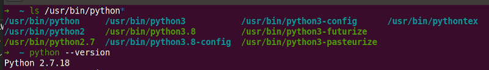
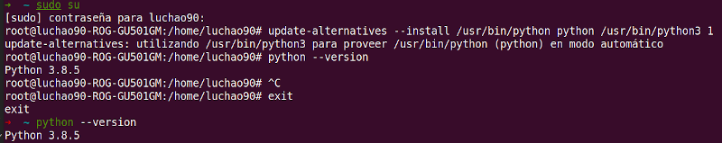

## Pymaketool install

In linux system:

* Press **ctrl + alt T** to open terminal.

Check if you already have python3 installed with following command:

* ``` python3 --version ``` 

If you don't have it execute followings commands:

* ``` sudo apt update ```
* ``` sudo apt install software-properties-common ```
* ``` sudo add-apt-repository ppa:deadsnakes/ppa ```
* ``` sudo apt update ```
* ``` sudo apt install python3.8 ```

Check default python interpreter with:

* ``` python --version ```

If python version message is **python2...** you need to change your default python interpreter to **python3**.

Let's see python installed versions:

* ``` ls /usr/bin/python* ```

You should see something like this:



Execute followings commands:

* ``` sudo su ```
* ``` update-alternatives --install /usr/bin/python python /usr/bin/python3 1 ```
* ``` exit ```

Now you can check default python again with:

* ``` python --version ```

Graphic example:



Now check pymaketool previous installation:

* ``` pymaketool -v ```

( _For following commands if **pip** doesn't work, try with **pip3**_ ) 

If you have it, uninstall for update:

* ``` sudo pip uninstall pymaketool ```

Install pymaketool:

* ``` sudo pip install pymaketool ```

Finally you can check correct installation with:

* ``` pymaketool -v ```

Go back to readme [readme](../../README.md)