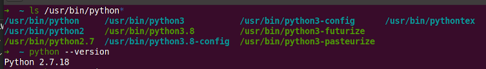
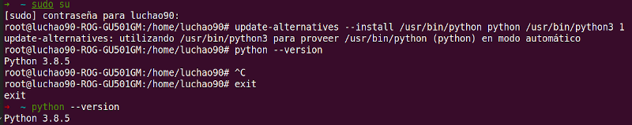

## Pymaketool Installation

On Linux systems:

* Press **Ctrl + Alt + T** to open a terminal.

Check if you already have Python 3 installed with the following command:

* ``` python3 --version ``` 

If you don't have it, execute the following commands:

* ``` sudo apt update ```
* ``` sudo apt install software-properties-common ```
* ``` sudo add-apt-repository ppa:deadsnakes/ppa ```
* ``` sudo apt update ```
* ``` sudo apt install python3.8 ```

Check the default Python interpreter with:

* ``` python --version ```

If the Python version message shows **python2...**, you need to change your default Python interpreter to **python3**.

Let's see the installed Python versions:

* ``` ls /usr/bin/python* ```

You should see something like this:



Execute the following commands:

* ``` sudo su ```
* ``` update-alternatives --install /usr/bin/python python /usr/bin/python3 1 ```
* ``` exit ```

Now you can check the default Python again with:

* ``` python --version ```

Graphic example:



Now check for a previous pymaketool installation:

* ``` pymaketool -v ```

(_For the following commands, if **pip** doesn't work, try **pip3**_)

If you have it installed, uninstall it first to update:

* ``` sudo pip uninstall pymaketool ```

Install pymaketool:

* ``` sudo pip install pymaketool ```

Finally, you can verify the installation with:

* ``` pymaketool -v ```

## Installation with Poetry

[Poetry](https://python-poetry.org/) is a modern Python dependency management tool that provides consistent environments and simplified package management.

### Install Poetry

* ``` curl -sSL https://install.python-poetry.org | python3 - ```

Or on some systems:

* ``` pip3 install poetry ```

### Install pymaketool using Poetry

Create a new directory for your project and initialize Poetry:

* ``` mkdir myproject && cd myproject ```
* ``` poetry init ```

Add pymaketool as a dependency:

* ``` poetry add pymaketool ```

Install dependencies:

* ``` poetry install ```

Verify the installation:

* ``` poetry run pymaketool -v ```

## Setting Up a C Project with Poetry

You can turn your C project into a Poetry-managed project for better dependency control.

### Step 1: Create the C project

* ``` poetry run pynewproject CLinuxGCC ```

Follow the prompts to create your project, then navigate into it:

* ``` cd your_project_name ```

### Step 2: Initialize Poetry in the C project

* ``` poetry init --name your_project_name --dependency pymaketool ```

Or create a **pyproject.toml** file manually:

```toml
[project]
name = "your_project_name"
version = "0.1.0"
description = "My C project using pymaketool"
authors = [{ name = "Your Name", email = "your@email.com" }]
requires-python = ">=3.10"
dependencies = ["pymaketool"]

[build-system]
requires = ["poetry-core>=2.0.0"]
build-backend = "poetry.core.masonry.api"
```

### Step 3: Install dependencies

* ``` poetry install ```

### Step 4: Build and run using Poetry

Clean the project:

* ``` poetry run make clean ```

Build the project:

* ``` poetry run make ```

Or build with verbose output:

* ``` poetry run make V=1 ```

Run the executable:

* ``` ./Release/your_project_name ```

### Benefits of Using Poetry

* **Reproducible builds**: Lock files ensure the same dependencies across all machines
* **Isolated environments**: Virtual environments prevent conflicts with system packages
* **Easy CI/CD integration**: Simple commands for continuous integration pipelines
* **Dependency resolution**: Automatic resolution of compatible package versions

Go back to readme [readme](../../README.md)