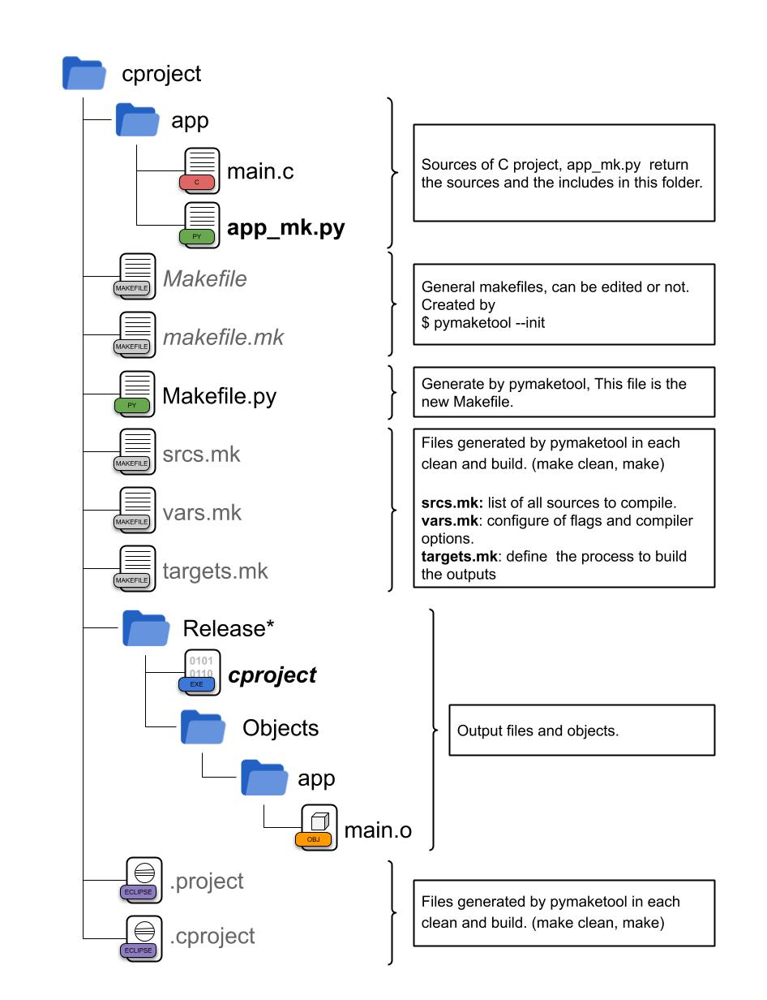

.. pymaketool documentation master file, created by
   sphinx-quickstart on Wed Oct  7 18:19:16 2020.
   You can adapt this file completely to your liking, but it should at least
   contain the root `toctree` directive.

pymaketool
======================================

Release v\ |version|. (:ref:`Installation <install>`)

.. image:: https://img.shields.io/pypi/l/pymaketool.svg
    :target: https://pypi.org/project/pymaketool/

.. image:: https://img.shields.io/pypi/wheel/pymaketool.svg
    :target: https://pypi.org/project/pymaketool/

.. image:: https://img.shields.io/pypi/pyversions/pymaketool.svg
    :target: https://pypi.org/project/pymaketool/

**pymaketool** is an elegant and simple tool to generate a C project with GNU Make files. 

----------------

**Behold, the power of pymaketool**

.. code-block:: python

   # app_mk.py
   from pymaketool.Module import ModuleHandle

   def getSrcs(m: ModuleHandle):
      return m.getAllSrcsC()
   
   def getIncs(m: ModuleHandle):
      return m.getAllIncsC()

Or in class mode:

.. code-block:: python

   # app_mk.py
   from pymakelib.Module import AbstractModule, ModuleClass, ModuleHandle

   @ModuleClass
   class Lib(AbstractModule):
      def getSrcs(self, m: ModuleHandle):
         return m.getAllSrcsC()

      def getIncs(self, m: ModuleHandle):
         return m.getAllIncsC()

**pymaketool** allow to you create C projects with anything structure extremely easily.
Use Eclipse IDE for open and edit your project, pymaketool generates the necessary files for this.

.. image:: img/pymaketool.jpg
  :width: 400
  :alt: pymaketool

----------------

**Structure of un pymaketool project**

.. toctree::
   :maxdepth: 2
   
   user/install
   user/makefile.py
   user/name_mk.py
   user/user_scripts
   user/addons
   user/logger

.. Indices and tables
.. ==================

.. * :ref:`genindex`
.. * :ref:`modindex`
.. * :ref:`search`
