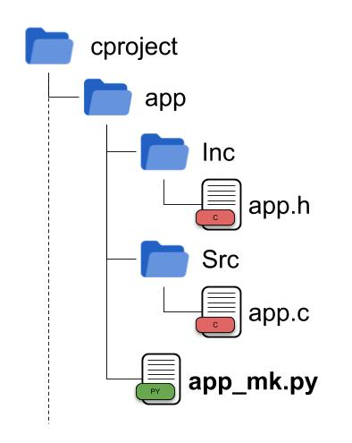

.. _name_mk.py:

<name>_mk.py
============

Python file that find and return the sources to compile in the current path.

The file name must end with **_mk.py**.

**app_mk.py** sample:

.. code-block:: python

    from pymakelib.module import ModuleHandle

    def init(mh: ModuleHandle):
        """
        Optional function, function that is always executed
        at the beginning of the module.
        """

    def getSrcs(mh: ModuleHandle):
        """
        Return the path of all sources in 'cproject/app'

        Returns:
            list of string or Path
        """
        return mh.getAllSrcsC()

    def getIncs(mh: ModuleHandle):
        """
        Return the folder of all includes in 'cproject/app'

        Returns:
            list of string or Path
        """
        return mh.getAllIncsC()

    def getCompilerOpts(mh: ModuleHandle):
        """
        Optional function, change in the options
        of how these sources are compiled.
        """
        opt = mh.getWorkspace()['compilerOpts']
        opt['CONTROL-C-OPTS'] = ['-std=c89']
        return opt

**app_mk.py** in hardcode mode:

.. code-block:: python

    from pymakelib.module import ModuleHandle

    def getSrcs(mh: ModuleHandle):
        return [
            'app/app.c'
        ]

    def getIncs(mh: ModuleHandle):
        return [
            'app'
        ]
