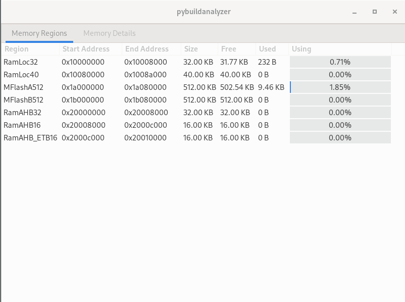
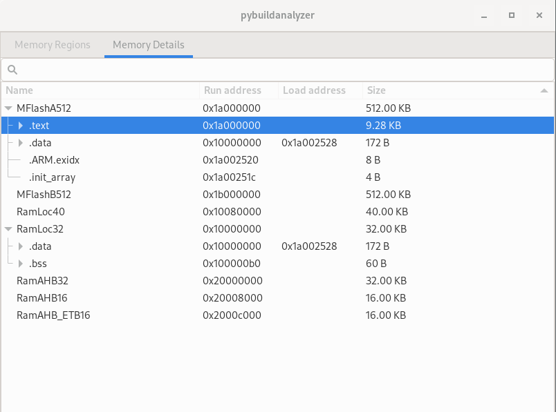

.. _tools:

pybuildanalyzer2
================

Util for ARM embedded systems. This utility summarizes memory usage and symbols size.

.. code-block:: bash

    $ pybuildanalyzer2 -h
    usage: pybuildanalyzer2 [-h] [-g] [-v] elf

    Builder Analyzer for ARM firmware

    positional arguments:
    elf            ELF file

    optional arguments:
    -h, --help     show this help message and exit
    -g, --gtk      Show in gtk window
    -v, --version  show program's version number and exit

Output in console
-----------------

.. code-block:: bash

    $ ./pybuildanalyzer2 Release/app/app.elf
    | Region      | Start          | End            |         Size|         Free|         Used             Usage(%) |
    | RamLoc32    | 0x10000000     | 0x10008000     |     32.00 KB|     31.77 KB|        232 B |          |   0.71% |
    | RamLoc40    | 0x10080000     | 0x1008a000     |     40.00 KB|     40.00 KB|          0 B |          |   0.00% |
    | MFlashA512  | 0x1a000000     | 0x1a080000     |    512.00 KB|    502.54 KB|      9.46 KB |▎         |   1.85% |
    | MFlashB512  | 0x1b000000     | 0x1b080000     |    512.00 KB|    512.00 KB|          0 B |          |   0.00% |
    | RamAHB32    | 0x20000000     | 0x20008000     |     32.00 KB|     32.00 KB|          0 B |          |   0.00% |
    | RamAHB16    | 0x20008000     | 0x2000c000     |     16.00 KB|     16.00 KB|          0 B |          |   0.00% |
    | RamAHB_ETB16| 0x2000c000     | 0x20010000     |     16.00 KB|     16.00 KB|          0 B |          |   0.00% | 

Output in GTK
-------------

.. code-block:: bash

    $ ./pybuildanalyzer2 -g Release/app/app.elf

pymakedot
=========

This utility create a simple dot file (a.out) of pymaketool modules. e.g.:

.. code-block:: bash

    $ pymakedot app/application/app_mk.py lib/lib_mk.py extlib/extlib_mk.py
    $ xdot a.out

.. graphviz::

    digraph module {
        main_c -> stdio_h;
        main_c -> lib_h;
        main_c -> module_lib_h;
        main_c -> stdint_h;

        subgraph cluster_0 {
            main_c -> main_h;
            label = "app_mk.py";
            color = blue;
        }
        subgraph cluster_1 {
            lib_c -> lib_h;
            label = "lib_mk.py";
            color = blue;
        }
        subgraph cluster_2 {
            module_lib_c -> module_lib_h;
            label = "extlib_mk.py";
            color = blue;
        }

        main_c [shape=box label="main.c"];
        stdio_h [shape=box label="stdio.h"];
        lib_h [shape=box label="lib.h"];
        module_lib_h [shape=box label="module_lib.h"];
        stdint_h [shape=box label="stdint.h"];
        main_h [shape=box label="main.h"];
        lib_c [shape=box label="lib.c"];
        module_lib_c [shape=box label="module_lib.c"];
    }
